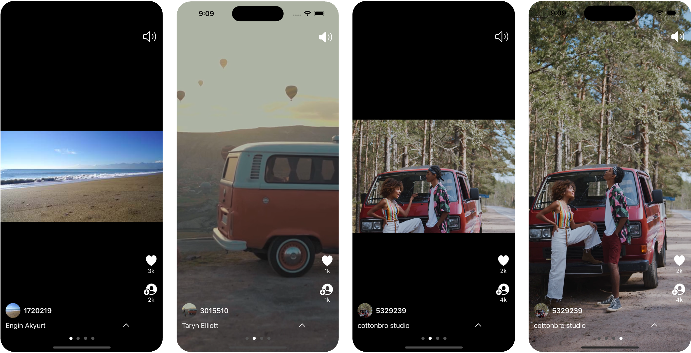

# 유튜브 숏폼 UI + 가로 스크롤 기능 구현해보기

### **1. 기능 구현 계기

유튜브와 인스타그램 어플에서 자주 사용하는 숏폼 기능을 이용하다가, 가로 스크롤 기능을 추가하면 어떨까라는 생각이 들었습니다. 기존에는 상하 스크롤로만 콘텐츠를 전환할 수 있었지만, 가로 스크롤을 이용하면 좀 더 다양한 방식으로 콘텐츠를 보여줄 수 있을 것 같았습니다. 이에, Pixels 닷컴의 API를 사용하여 사진과 비디오 데이터를 불러와 가로 셀 형태로 하나의 비디오 정보를 다양하게 확인할 수 있도록 구현하였습니다. 이 기능을 적용하면 한 게시물 안에서 여러 개의 콘텐츠를 보다 쉽고 빠르게 확인할 수 있을 것입니다.

### **2. 앱 UI/UX**

### **3. 앱 세부기능**

- 피드 스크롤시 포커스 되는 영역에 따라, 영상이 플레이 되고, 다른 영상은 정지가 됩니다.
- 첫 피드를 받을때 피드 API 에러가 나는 경우, 다시 시도하기 버튼을 중앙에 보여주고, 다시 시도 버튼을 누를 경우 다시 피드 API를 호출합니다.
- 영상의 스피커 버튼을 누르면, 음소거가 적용, 다시 탭하면 소리가 재생이 됩니다.
- 위아래로 스크롤 시, 다음 또는 이전 포스트로 넘어가며 포스트가 스냅에 걸립니다.
- 위/아래/좌/우 스크롤 시, 영상일 경우 포커스 되는 쪽이 재생이 되고 나머지는 정지가 됩니다.
- 포스트 글이 2줄이상이 될 경우에, 화살표를 탭하면 라벨 UI가 펼쳐집니다.
- 하단에 페이지컨트롤이 적용됩니다.
- 포스트 하단으로 스크롤할 때, 일정 셀에 도달하면 추가 피드 API를 호출하는 페이지네이션이 작동됩니다..

### 5. 개선사항

- 모든 에러 처리에 대한 대응하기 (현재는 앱 초기 실행 시 발생한 오류에 한해서만 대응 중)
- 포스트 글이 2줄 이하인 경우에도 탭 버튼 존재 -> 2줄 이하인 경우에는 화살표 버튼 안보이도록 구현 필요
- 피드가 랜더링되는 순간의 로딩화면 필요
- 위아래 스크롤 시 피드의 첫번째 포스트가 아닌 두세번째 포스트인 채로 랜더링되는 이슈 발생
- 페이지네이션으로 API 호출 시 오류가 발생할 경우, 토스트를 띄어줄 뿐만 아니라 어느 시점에 재호출해 줄 수 있는지 고민 필요
- 어플 실행 시, 타 어플의 오디오 멈춤 현상 해결하기